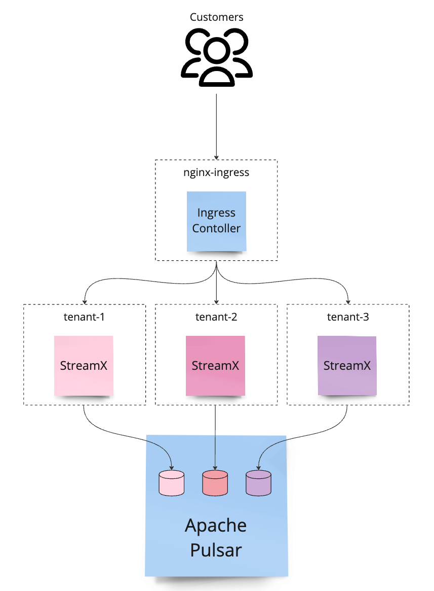

# StreamX Helm Chart
[](https://opensource.org/licenses/Apache-2.0)   

This chart bootstraps StreamX on a Kubernetes cluster.

## Names and labels convention

Since the chart consists of multiple components, the `metadata.name` contains the component's name, and `app.kubernetes.io/component` label was introduced for each component.
See the `templates/_helpers.tpl` helper functions to see the implementation details.

## Parameters

| Key | Type | Default | Description |
|-----|------|---------|-------------|
| delivery | object | `{}` | `Delivery Services` map |
| imagePullSecrets | list | `[]` | imagePullSecrets used to authenticate to registry containing StreamX and custom services |
| messaging | object | `{}` | used to configure messaging system like Apache Pulsar, see examples for reference |
| monitoring.enabled | bool | `false` | enabling this flag will enable creating `monitoring.coreos.com` Custom Resources for all services |
| processing | object | `{}` | `Processing Services` map |
| rest_ingestion.allInboxesTopicPatter | string | `"inboxes/.*"` | all-inboxes topic pattern in format: `namespace/topic-regex` |
| rest_ingestion.enabled | bool | `true` | enables REST Ingestion Service |
| rest_ingestion.env | list | `[]` | additional environment variables |
| rest_ingestion.image | string | `nil` | image repository and tag, defaults to `europe-west1-docker.pkg.dev/streamx-releases/streamx-docker-releases/dev.streamx/rest-ingestion-service:{{ .Chart.AppVersion }}` |
| rest_ingestion.ingress | object | `{}` | ingress settings, set `host` to enable ingress |
| rest_ingestion.monitoring | object | `{}` | pod monitoring configuration |
| rest_ingestion.nodeSelector | object | `{}` | node labels for pod assignment |
| rest_ingestion.probes | object | `{}` | probes settings, see tests for reference |
| rest_ingestion.replicas | int | `1` | number of replicas |
| rest_ingestion.resources | object | `{}` | resources for the container |
| tenant | string | `nil` | overwrites tenant for this release installation, defaults to `.Release.Name` |

## Services Mesh

Services Mesh is a set of services that process and deliver the content to the end-user. The chart comes with an empty services mesh configuration, which means that no processing and delivery services will be deployed.

### Processing services

Configuring processing services is done via `processing` object, check the syntax in `values.yaml`. The chart comes with an empty `processing` object, which means that no processing services will be deployed.

#### Incoming channels
Processing services process data from `incoming` channels and can produce data to `outgoing` channels. Channels are defined as a map of channel objects, where key is a channel name and value is a channel configuration. See the [`values.yaml`](values.yaml) for more details.
```yaml
incoming:
  incoming-pages:
    namespace: my-namespace
    topic: my-topic
```
The namespace and topic are used for Apache Pulsar topic URL construction. The fully qualified Apache Pulsar URL is constructed as follows: `persistent://<tenant>/<namespace>/<topic>`. The tenant is configured via `pulsar.tenant` value.

Apache Pulsar topic URL is available as an environment variable in the processing service container under the following name: `MP_MESSAGING_INCOMING_<CHANNEL>_TOPIC`.

For the example above and `tenant: my-tenant`, the environment variable will be:
```conf
MP_MESSAGING_INCOMING_INCOMING-PAGES_TOPIC=persistent://my-tenant/my-namespace/my-topic
```

#### Outgoing channels
Processing services can produce data to `outgoing` channels. The following evniroment variables are available for each channel:
- `MP_MESSAGING_OUTGOING_<CHANNEL>_TOPIC` - a fully qualified Apache Pulsar URL (e.g. `persistent://my-tenant/my-namespace/my-topic`) of the topic to write to, where `<CHANNEL>` is the channel name in upper case (e.g. `MP_MESSAGING_OUTGOING_INCOMING-PAGES_TOPIC`)

#### Environment variables
Every processing service container gets the following environment variables:
- `PULSAR_SERVICE_URL` - Apache Pulsar Broker Service URL
- `PULSAR_WEB_SERVICE_URL` - Apache Pulsar REST API URL

### Delivery services

Delivery service is a `Deployment` that is responsible for delivering the content to the end-user. It reads data from `inputs` and exposes it via `outputs`. It can store its `data` in volumes that are mounted to the `Deployment` PODs. The data lifecycle is connected with the deployment pods' lifecycle (that means if the pod is deleted, the volume is deleted as well).

Delivery services are configured via `delivery` list of objects. See the [`values.yaml`](values.yaml) for more details.

#### Incoming
Delivery services, similarly to Processing services synchronize data from `incoming` channels to their `data` volumes. The following environment variables are available for each input:
- `MP_MESSAGING_INCOMING_<CHANNEL>_TOPIC` - a fully qualified Apache Pulsar URL (e.g. `persistent://my-tenant/my-namespace/my-topic`) of the topic to read from
- `MP_MESSAGING_INCOMING_<CHANNEL>_SUBSCRIPTIONNAME` - unique subscription name for the incoming topic

#### Outputs
The important concept of each delivery service is its `output` object. A single delivery service may define multiple `outputs`. See the sketch below:


#### Data
Delivery service defines two `emptyDir` volumes by default:
- `repository`
- `metadata`


Each delivery service container can mount these volumes to its filesystem under configured mount paths (see container's `data.repositoryMountPath` and `data.metadataMountPath`).

The size of the volumes can be configured via `data.repositorySize` and `data.metadataSize` values on the Delivery Service level.

#### Environment variables
Every delivery service container gets the following environment variables:
- `PULSAR_SERVICE_URL` - Apache Pulsar Broker Service URL
- `PULSAR_WEB_SERVICE_URL` - Apache Pulsar REST API URL

### Liveness, Readiness and Startup Probes
By default, each type of services has all probes enabled. You can disable them by setting `enabled` to `false` in the `probes` object for the corresponding service. Additionally, each probe can be configured separately. See the unit tests for reference.

## Multi-tenancy

> This feature is available only for `Apache Pulsar` messaging system.

StreamX supports multi-tenant deployments with Apache Pulsar multi-tenancy feature. We recommend to create a separate Kubernetes namespace for each tenant to isolate its services and data.

To configure the tenant directly, use the `tenant` property value, otherwise it will default to the chart's release name.

### Tenant initialization

When the `messaging.pulsar.initTenant.enabled` is set to `true`, the chart will create a `Job` that initializes the tenant. The tenant initialization includes both Apache Pulsar tenant and namespaces configuration. The tenant initialization is done only once, and it is not idempotent (the automatic update of the tenant configuration is not supported OOTB, manual intervention is required). See the local development section for the example of a single tenant initialization.

To customise tenant initialization, you can:
- set `messaging.pulsar.initTenant.enabled` to `false` and initialize the tenant manually,
- configure custom `pulsar-init` container image via `messaging.pulsar.initTenant.customImage` value.

### Multi-tenant installation

Tenant initialization has to be performed for each tenant. The tenant's data is isolated from other tenants at both the Kubernetes and Apache Pulsar levels (even when a single Apache Pulsar installation is used).

The diagram below shows the multi-tenant StreamX installations with a shared Apache Pulsar:



As you can see, each tenant has its own Kubernetes namespace (`tenant-1`, `tenant-2`, `tenant-3`) and initialize its own Apache Pulsar tenant and namespaces.

### Local development

For local development, we will prepare a `kind` cluster with `extraPortMappings` and install StreamX from the chart with a single tenant (`tenant-1`).

#### Prerequisites

1. Install [`kind`](https://kind.sigs.k8s.io/docs/user/quick-start/#installation) and configure [`kind` cluster with `extraPortMappings`](https://kind.sigs.k8s.io/docs/user/ingress/#create-cluster) and `kubectl` context to use it.
   ```bash
   kind create cluster --config .github/cluster/kind-cluster.yaml
   ```

2. Install [`helm`](https://helm.sh/docs/intro/install/).
3. Install StreamX Chart prerequisites with `./.github/scripts/install-prerequisites.sh`. It will install:
   - NginX Ingress controller configured for Kind,
   - Apache Pulsar,
   - `[optionally]` Prometheus Operator (disabled by default).

#### Installing StreamX from Chart

> Note: to run StreamX services locally, you need access to StreamX private repository.

1. Create secret for Rest Ingrestion Auth:
   ```bash
   kubectl create namespace tenant-1 || true
   kubectl apply -f examples/tenant-1/secrets/rest-ingestion-jwt-keys.yaml
   ```

   <details>
   <summary>Show how to generate secret for Rest Ingestion Auth</summary>
   <p>

   ```bash
   openssl genrsa -out rsaPrivateKey.pem 2048
   openssl rsa -pubout -in rsaPrivateKey.pem -out key.pub
   openssl pkcs8 -topk8 -nocrypt -inform pem -in rsaPrivateKey.pem -outform pem -out key.pem
   kubectl create namespace tenant-1 || true
   kubectl -n tenant-1 create secret generic streamx-api-keys --from-file=./key.pem --from-file=./key.pub
   ```
   </p>
   </details>

2. Create `docker-registry` secret to enable Kubernetes to pull images from the StreamX private repository:
   ```bash
   TOKEN=$(gcloud auth print-access-token)
   kubectl -n tenant-1 create secret docker-registry streamx-gar-json-key \
     --docker-server=europe-west1-docker.pkg.dev \
     --docker-username=oauth2accesstoken \
     --docker-password="${TOKEN}"
   ```
   <details>
   <summary>Show how to use locally built images</summary>
   <p>
   Alternatively, you can build images on your host and use `kind load` to load them into the cluster, e.g.:

   ```bash
   kind load docker-image europe-west1-docker.pkg.dev/streamx-releases/streamx-docker-snapshots/dev.streamx/reference-web-delivery-service:1.0-SNAPSHOT
   kind load docker-image europe-west1-docker.pkg.dev/streamx-releases/streamx-docker-snapshots/dev.streamx/reference-relay-processing-service:1.0-SNAPSHOT
   kind load docker-image europe-west1-docker.pkg.dev/streamx-releases/streamx-docker-snapshots/dev.streamx/rest-ingestion-service:1.0-SNAPSHOT
   kind load docker-image europe-west1-docker.pkg.dev/streamx-releases/streamx-docker-snapshots/dev.streamx/pulsar-init:1.0-SNAPSHOT
   ```
   </p>
   </details>
3. Prepare Apache Pulsar for StreamX installation (run it only for the first time installation):

   > NOTE: DO NOT CHANGE THIS COMMAND TO UPGRADE AS IT WILL CLEAR ALL RUNNING STEAMX PODS!

   ```bash
    helm install streamx ./chart -n tenant-1 \
      --set "imagePullSecrets[0].name=streamx-gar-json-key" \
      --set messaging.pulsar.initTenant.enabled=true \
      --set rest_ingestion.enabled=false \
      -f examples/tenant-1/messaging.yaml
    ```
    This command will give you `kubectl` command to check status of initialization job. Run it and wait for the job to complete.

   <details>
   <summary>Show how to initialise StreamX chart from public release</summary>
   <p>
   > You still need to download `examples/tenant-1/*.yaml` files from the repository.

   ```bash
   helm install streamx streamx --repo https://streamx-dev.github.io/streamx-chart -n tenant-1 \
     --set "imagePullSecrets[0].name=streamx-gar-json-key" \
     --set messaging.pulsar.initTenant.enabled=true \
     --set rest_ingestion.enabled=false \
     -f examples/tenant-1/messaging.yaml
   ```
   </p>
   </details>

4. Install StreamX Mesh with Helm chart:
   ```bash
   helm upgrade streamx ./chart -n tenant-1 \
     --set "imagePullSecrets[0].name=streamx-gar-json-key" \
     -f examples/tenant-1/messaging.yaml \
     -f examples/tenant-1/ingestion.yaml \
     -f examples/tenant-1/processing.yaml \
     -f examples/tenant-1/delivery.yaml
   ```

   <details>
   <summary>Show how to install StreamX chart from public release</summary>
   <p>
   > You still need to download `examples/tenant-1/*.yaml` files from the repository.

   ```bash
   helm upgrade streamx streamx --repo https://streamx-dev.github.io/streamx-chart -n tenant-1 \
     --set "imagePullSecrets[0].name=streamx-gar-json-key" \
     -f examples/tenant-1/messaging.yaml \
     -f examples/tenant-1/ingestion.yaml \
     -f examples/tenant-1/processing.yaml \
     -f examples/tenant-1/delivery.yaml
   ```
   </p>
   </details>

#### Validation
Check that all deployments are running:

```bash
kubectl -n tenant-1 rollout status deployment -l app.kubernetes.io/instance=streamx
```

Next, from the `examples/tenant-1/e2e` run:
```bash
export STREAMX_INGESTION_REST_AUTH_TOKEN_TENANT_1=$(kubectl -n tenant-1 run jwt-token-provider --rm --restart=Never -it -q --image=curlimages/curl -- curl -X 'POST' 'http://streamx-rest-ingestion/auth/token?upn=test')
./mvnw verify
```

> Note: you need JDK 17 to run the tests.

<details>
<summary>See how to validate reference flow manually with cURL</summary>
<p>

Fetch JWT token to authenticate with StreamX REST Ingrestion Service (`/auth/token` endpoint is not exposed via ingress):
```bash
export STREAMX_INGESTION_REST_AUTH_TOKEN_TENANT_1=$(kubectl -n tenant-1 run jwt-token-provider --rm --restart=Never -it -q --image=curlimages/curl -- curl -X 'POST' 'http://streamx-rest-ingestion/auth/token?upn=test')
```

Refresh the Ingestion Service schema by calling:
```bash
curl -X 'GET' \
  'http://streamx-api.127.0.0.1.nip.io/publications/v1/schema' \
  -H "Authorization: Bearer ${STREAMX_INGESTION_REST_AUTH_TOKEN_TENANT_1}" \
  -H 'accept: */*'
```

It should return an array of available publication types.

Run the command below to publish a new page:

```bash
curl -X 'PUT' \
  'http://streamx-api.127.0.0.1.nip.io/publications/v1/pages/test.html' \
  -H 'accept: */*' \
  -H 'Content-Type: application/json' \
  -H "Authorization: Bearer ${STREAMX_INGESTION_REST_AUTH_TOKEN_TENANT_1}" \
  -d '{
  "content": {"bytes": "<h1>Hello StreamX!</h1>"}
}'
```

Open in the browser [streamx.127.0.0.1.nip.io/test.html](http://streamx.127.0.0.1.nip.io/test.html).

### Testing

#### Helm unit tests
Run `helm unittest -f 'tests/unit/*.yaml' .` from `chart`.

### Releasing
1. Update the version in `chart/Chart.yaml`.
2. Generate README.md with `./generate-docs.sh`.
3. Commit and push changes.
4. Run [Release action](https://github.com/streamx-dev/streamx-chart/actions/workflows/release-publish-chart.yaml) to publish the chart to the GitHub Pages.