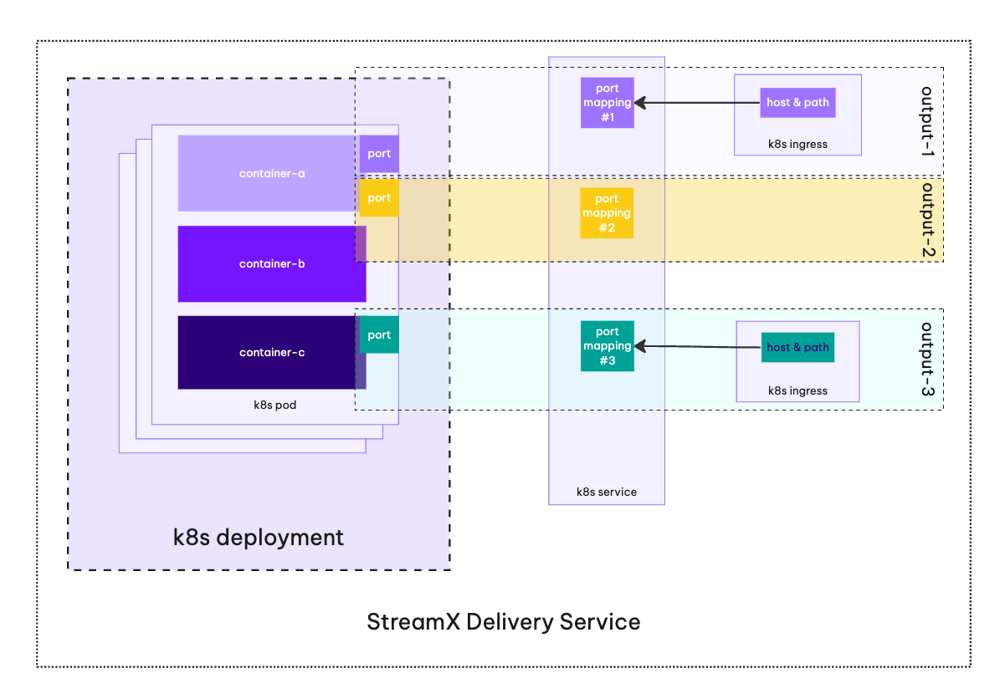
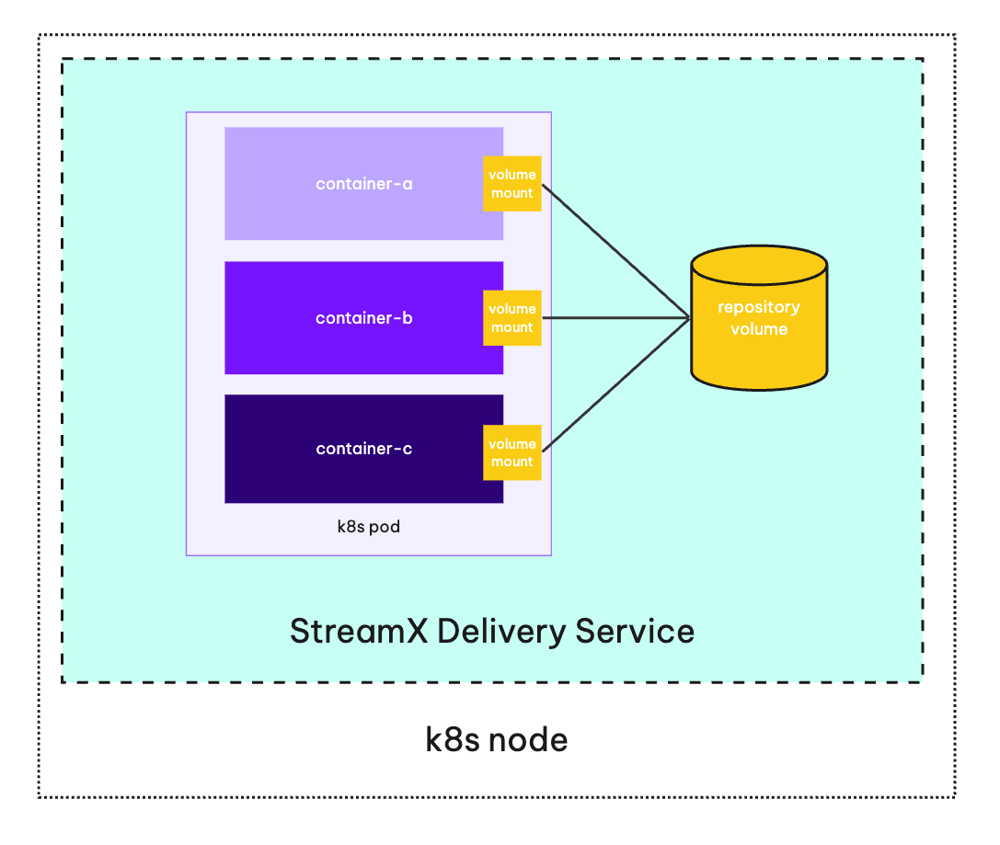
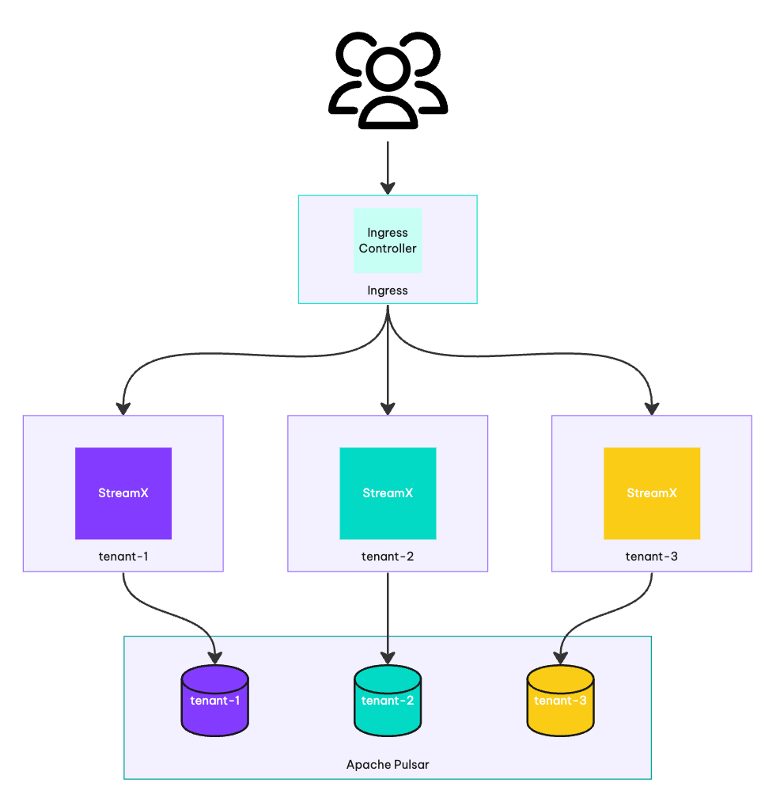

# StreamX Helm chart concepts

## Names and labels convention

Since the chart consists of multiple components, the `metadata.name` contains the component's name, and `app.kubernetes.io/component` label was introduced for each component.
See the `templates/_helpers.tpl` helper functions to see the implementation details.

## Services Mesh

Services Mesh is a set of services that process and deliver the content to the end-user. The chart comes with an empty services mesh configuration, which means that no processing and delivery services will be deployed.

### Processing services

Configuring processing services is done via `processing` object, check the syntax in `values.yaml`. The chart comes with an empty `processing` object, which means that no processing services will be deployed.

#### Incoming channels
Processing services process data from `incoming` channels and can produce data to `outgoing` channels. Channels are defined as a map of channel objects, where key is a channel name and value is a channel configuration. See the [`values.yaml`](values.yaml) for more details.
```yaml
incoming:
  incoming-pages:
    namespace: my-namespace
    topic: my-topic
```
The namespace and topic are used for Apache Pulsar topic URL construction. The fully qualified Apache Pulsar URL is constructed as follows: `persistent://<tenant>/<namespace>/<topic>`. The tenant is configured via `pulsar.tenant` value.

Apache Pulsar topic URL is available as an environment variable in the processing service container under the following name: `MP_MESSAGING_INCOMING_<CHANNEL>_TOPIC`.

For the example above and `tenant: my-tenant`, the environment variable will be:
```conf
MP_MESSAGING_INCOMING_INCOMING-PAGES_TOPIC=persistent://my-tenant/my-namespace/my-topic
```

#### Outgoing channels
Processing services can produce data to `outgoing` channels. The following evniroment variables are available for each channel:
- `MP_MESSAGING_OUTGOING_<CHANNEL>_TOPIC` - a fully qualified Apache Pulsar URL (e.g. `persistent://my-tenant/my-namespace/my-topic`) of the topic to write to, where `<CHANNEL>` is the channel name in upper case (e.g. `MP_MESSAGING_OUTGOING_INCOMING-PAGES_TOPIC`)

#### Environment variables
Every processing service container gets the following environment variables:
- `PULSAR_SERVICE_URL` - Apache Pulsar Broker Service URL
- `PULSAR_WEB_SERVICE_URL` - Apache Pulsar REST API URL

### Delivery services

Delivery service is a `Deployment` that is responsible for delivering the content to the end-user. It reads data from `inputs` and exposes it via `outputs`. It can store its `data` in volumes that are mounted to the `Deployment` PODs. The data lifecycle is connected with the deployment pods' lifecycle (that means if the pod is deleted, the volume is deleted as well).

Delivery services are configured via `delivery` list of objects. See the [`values.yaml`](values.yaml) for more details.

#### Incoming
Delivery services, similarly to Processing services synchronize data from `incoming` channels to their `data` volumes. The following environment variables are available for each input:
- `MP_MESSAGING_INCOMING_<CHANNEL>_TOPIC` - a fully qualified Apache Pulsar URL (e.g. `persistent://my-tenant/my-namespace/my-topic`) of the topic to read from
- `MP_MESSAGING_INCOMING_<CHANNEL>_SUBSCRIPTIONNAME` - unique subscription name for the incoming topic

#### Outputs
The important concept of each delivery service is its `output` object. A single delivery service may define multiple `outputs`. See the sketch below:



#### Data
Delivery service defines `emptyDir` volume for `repository` data by default. The repository is used to share data between delivery service pod containers (e.g. between messaging client and http proxy server).



Each delivery service container can mount `repository` volume to its filesystem under the configured mount path (see container's `data.repositoryMountPath`) with read/write permissions.

The size of the volumes can be configured via `data.repositorySize` value on the Delivery Service level.

#### Environment variables
Every delivery service container gets the following environment variables:
- `PULSAR_SERVICE_URL` - Apache Pulsar Broker Service URL
- `PULSAR_WEB_SERVICE_URL` - Apache Pulsar REST API URL

### Liveness, Readiness and Startup Probes
By default, each type of services has all probes enabled. You can disable them by setting `enabled` to `false` in the `probes` object for the corresponding service. Additionally, each probe can be configured separately. See the unit tests for reference.

## Multi-tenancy

> This feature is available only for `Apache Pulsar` messaging system.

StreamX supports multi-tenant deployments with Apache Pulsar multi-tenancy feature. We recommend to create a separate Kubernetes namespace for each tenant to isolate its services and data.

To configure the tenant directly, use the `tenant` property value, otherwise it will default to the chart's release name.

### Tenant initialization

When the `messaging.pulsar.initTenant.enabled` is set to `true`, the chart will create a `Job` that initializes the tenant. The tenant initialization includes both Apache Pulsar tenant and namespaces configuration. The tenant initialization is done only once, and it is not idempotent (the automatic update of the tenant configuration is not supported OOTB, manual intervention is required). See the local development section for the example of a single tenant initialization.

To customise tenant initialization, you can:
- set `messaging.pulsar.initTenant.enabled` to `false` and initialize the tenant manually,
- configure custom `pulsar-init` container image via `messaging.pulsar.initTenant.image` value.

### Multi-tenant installation

Tenant initialization has to be performed for each tenant. The tenant's data is isolated from other tenants at both the Kubernetes and Apache Pulsar levels (even when a single Apache Pulsar installation is used).

The diagram below shows the multi-tenant StreamX installations with a shared Apache Pulsar:



As you can see, each tenant has its own Kubernetes namespace (`tenant-1`, `tenant-2`, `tenant-3`) and initialize its own Apache Pulsar tenant and namespaces.
